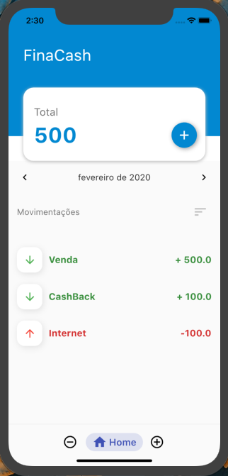
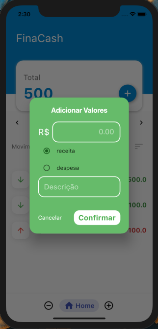
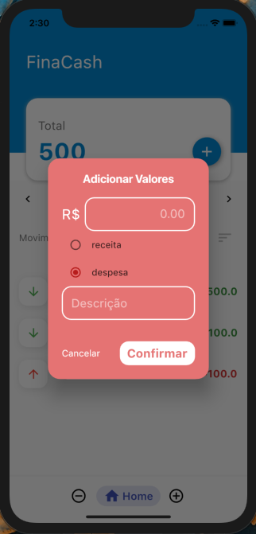
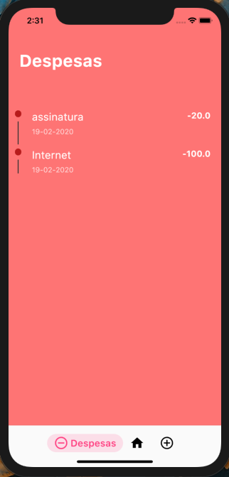
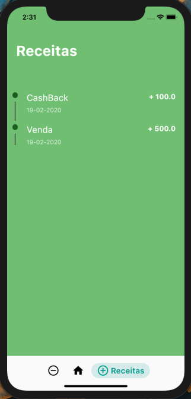
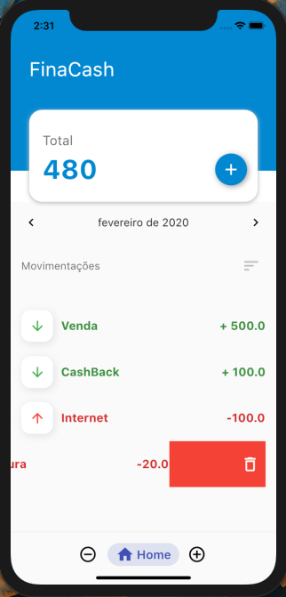
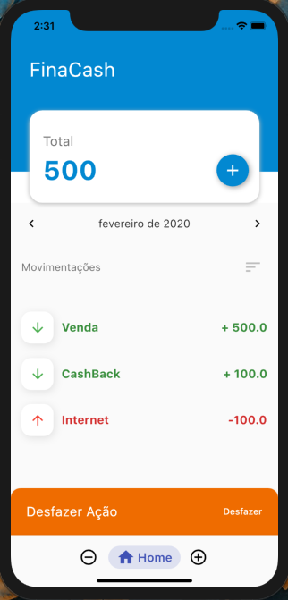

# Finance_App_Flutter
 
Aplicatico de Finanças Pessoais , com o intuito de prover maior controle financeiro para o usuário.
  

  
 
 
 
 
 
 
 
 

 
 

   
 
 ## Video Demonstrativo
 
 [Finance App Video](https://youtu.be/pRvfg-vv_Ig)
   
 
 
 ## Install App
 
 [GooglePlay Download App](https://play.google.com/store/apps/details?id=com.dantas.thiago.finacash)
   
 
 # O App aborda:

    • NavigaionBar Animated
  
    • ListView.
    
    • TableCalendar
  
    • SqFlite ( persistência de dados)
  
    • Custom Dialog
    
    • Dismissible
    
    • SnackBar
    
    • Custom TimeLine( Telas 'Despesas' e 'Receitas')
    
    
    
